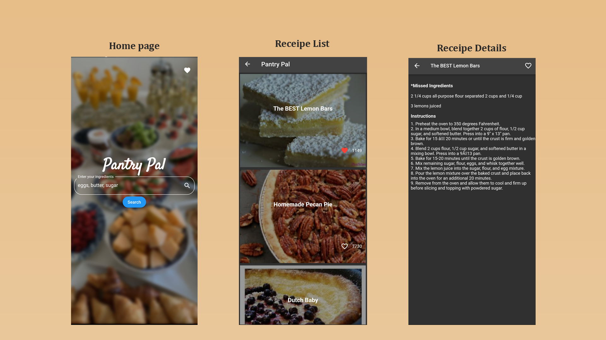

# Pantry Pal

A receipe application used to discover dishes that can be made using 
the provided available ingredients
Enter the ingredients available at your disposal and discover up to 10
receipes that can be made using those ingredients sorted based on popularity

The application uses the [spoonacular API](https://spoonacular.com/food-api) to derive the dishes from the ingredients

## Screenshots


## Requirements
1. [Flutter](https://docs.flutter.dev/get-started/install)
2. [Android Studio](https://developer.android.com/codelabs/basic-android-kotlin-compose-install-android-studio)
   
## Setting up dev
1. Clone the repository
    ```bash
    git clone <url>
    ```
2. Enter the created directory `pantry_pal` using the terminal
   ```bash
   cd pantry_pal
   ```
3. Install the necessary dependencies
   ```bash
   flutter pub get
   ```
4. Run the project
   - Either navigate the **lib/main.dart** file and click the `run` button
   - Or using the terminal
     ```bash
     flutter run
     ```

## Built with
1. [Spoonacular](https://spoonacular.com/food-api)